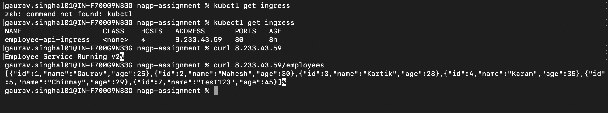

# nagpassignemnt

## Project Overview
This project demonstrates deployment of a multi-tier application on Google Kubernetes Engine (GKE) with the following components:

•	Service/API Tier (Node.js API)
•	PostgreSQL Database Tier
•	Kubernetes Secrets
•	Persistent Volume Claim (PVC)
•	Horizontal Pod Autoscaler (HPA)
•	Ingress for external access
•	FinOps optimizations using resource requests and limits

## Repository
 # GitHub Repository:
 [Repo Link](https://github.com/ergsinghal08/nagpassignemnt)

 ## Docker Images
 # Docker Hub Repository:
 [Docker Hub repo link](https://hub.docker.com/repository/docker/gsinghal08/my-nagp-api/)

 # Docker Image
gsinghal08/my-nagp-api:v1
gsinghal08/my-nagp-api:v2

# Service Api URL

Ingress URL
[Ingress URL](http://8.233.43.59/employees)

This endpoint retrieves employee records stored in PostgreSQL.

# Screen Recording
[Recording Link](https://nagarro-my.sharepoint.com/:f:/p/gaurav_singhal01/IgAl0ojn4KT1R411i2JCh4X_AfsYL3BpKLiPytCivVOyK74?e=vridyx)

